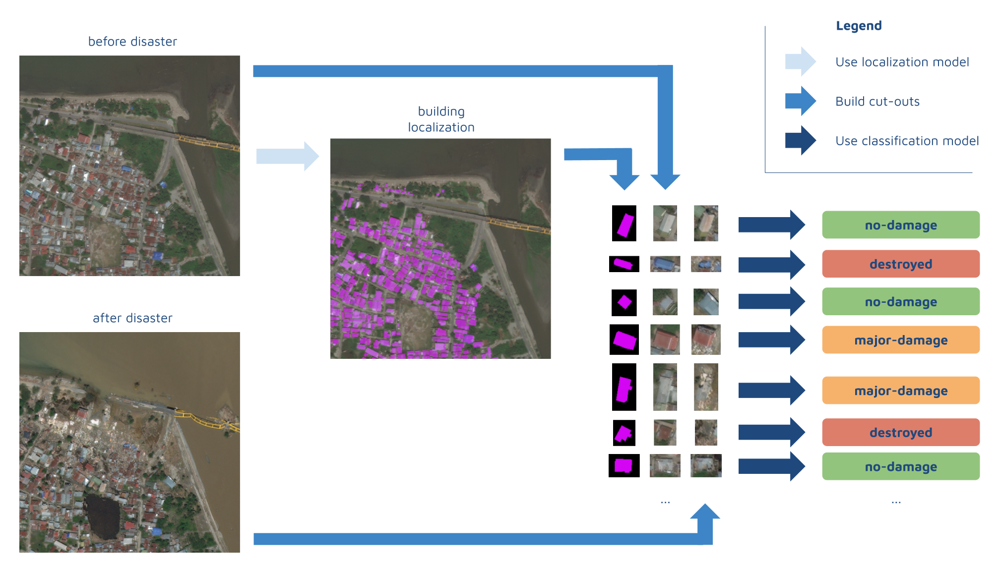

# Disaster-Relief-Project

## Table of Contents

- [Data Preparation Notebook](data_preparation.ipynb)
- [Algorithm Notebook](disaster_model.ipynb)
- STK API Simulation Helper Functions
  - [Search simulator](search_simulator.py)
  - [Survivor simulator](survivor_simulator.py)

## Findings
I found using satellites, UAV’s, and image analysis with Deep Learning significantly shortens search and rescue time (from days to hrs) in natural disasters. 

## How I tested these results
1. Used Satellite picture analysis with a convolutional neural network implemented from scratch using PyTorch to significantly reduce search and rescue time in natural disaster response by deploying UAV’s to target areas affected by disasters based off of my algorithm. 

2. Simulated results using a systems engineering software called Systems Tool Kit (STK). 

## Authors

- **Alex Lavaee**

## License

This project is licensed under the MIT License - see the [LICENSE.md](LICENSE.md) file for details
